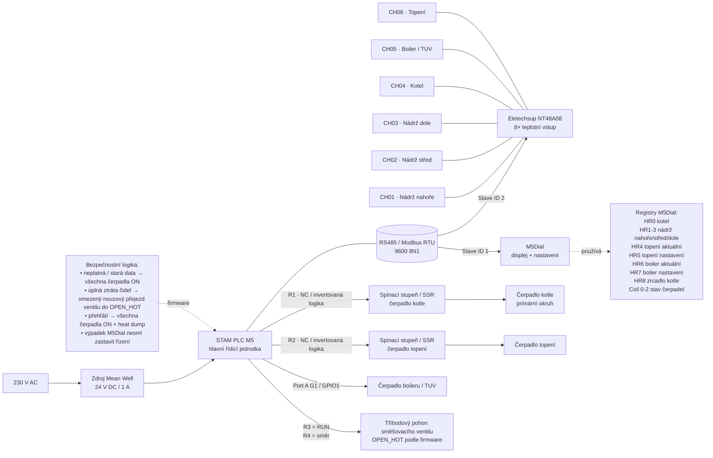

# Schéma systému řízení kotle — STAM PLC + NT48A08 + M5Dial

> Funkční / systémové schéma vytvořené podle firmware a fotografií instalace.
> Není to revizní ani svorkové 230V schéma. Zobrazuje hlavně logické vazby, komunikaci a funkce jednotlivých částí.

## Mapování teplotních čidel NT48A08

Schéma vychází z **reálně vykonávaného mapování v `readNT48()`**, tedy:

| Kanál | Význam |
|---|---|
| CH01 | Nádrž nahoře |
| CH02 | Nádrž střed |
| CH03 | Nádrž dole |
| CH04 | Kotel |
| CH05 | Boiler / TUV |
| CH06 | Topení |

> Poznámka: ve zdrojáku jsou u deklarací proměnných starší komentáře, které prohazují CH04 a CH06. Pro dokumentaci je důležité držet se skutečného mapování v `readNT48()`.

## Modbus komunikace

- **Jedna společná sběrnice RS485 / Modbus RTU**
- **STAM PLC M5** je master
- **M5Dial** je slave **ID 1**
- **NT48A08** je slave **ID 2**

## Výstupy PLC

| Výstup | Funkce |
|---|---|
| Relay 1 | Čerpadlo kotle (NC / invertovaná logika v softwaru) |
| Relay 2 | Čerpadlo topení (NC / invertovaná logika v softwaru) |
| Relay 3 | RUN pro pohon směšovacího ventilu |
| Relay 4 | Směr pohonu ventilu; `OPEN_HOT` podle firmware |
| Port A G1 / GPIO1 | Čerpadlo boileru / TUV |

## Registry M5Dial

| Adresa | Význam |
|---|---|
| HR0 | Teplota kotle |
| HR1 | Teplota nádrž nahoře |
| HR2 | Teplota nádrž střed |
| HR3 | Teplota nádrž dole |
| HR4 | Aktuální teplota topení |
| HR5 | Nastavená teplota topení |
| HR6 | Aktuální teplota boileru / TUV |
| HR7 | Nastavená teplota boileru / TUV |
| HR8 | Zrcadlená teplota kotle |
| Coil 0 | Stav čerpadla kotle |
| Coil 1 | Stav čerpadla topení |
| Coil 2 | Stav čerpadla boileru / TUV |

## Poznámky pro GitHub README

- Tohle schéma je ideální pro `README.md` nebo `docs/diagram.md`.
- Mermaid verze se na GitHubu dobře zobrazuje a dá se snadno upravovat.
- Záměrně neobsahuje svorkové ani detailní 230V zapojení tam, kde ho nelze ze snímků a kódu jednoznačně prokázat.
